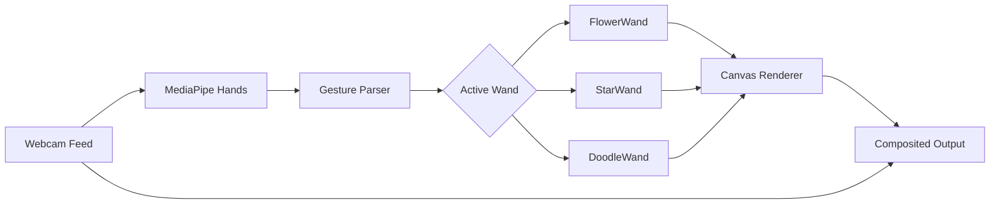

<div align="center">

# 🪄 Magical Wands

### Cast ethereal flowers, constellations & neon light ribbons — using just your hands.

[](https://nextjs.org/)
[](https://mediapipe.dev/)
[](https://react.dev/)
[](LICENSE)

<br/>

> A real-time, gesture-controlled creative canvas powered by Google MediaPipe Hands and HTML5 Canvas. Point your index finger to plant flowers, trace constellations, or sketch luminous doodles mid-air — all at 60 FPS inside your browser.

<br/>

</div>

---

## ✨ Features

| Wand | Gesture | What It Does |
|---|---|---|
| 🌸 **Flower Bloom** | Point index finger | Plants procedurally-generated flowers (20 unique species) along your finger trail |
| ⭐ **Star Magic** | Point → Fist → Open Palm | Place stars → Charge constellation → Release a "Make a Wish" explosion |
| ✏️ **Air Doodle** | Point to draw · Open palm to clear | Freehand neon drawing in mid-air with customizable brush |
| 📸 **Photo Capture** | Shutter button | Composites webcam + canvas art into a downloadable PNG |
| 🎥 **Video Recording** | Shutter button (Video mode) | Records canvas animations as downloadable WebM video |

### Additional Highlights

- **Mouse / Touch Fallback** — No webcam? No problem. Full interactive mode with mouse or touch input.
- **20 Hand-Drawn Flower Species** — Daisy, Sakura, Sunflower, Lotus, Rose, Poppy, and 14 more — all rendered as pre-cached sprite canvases for buttery performance.
- **Constellation Physics** — Stars connect with constellation lines, charge with a fist gesture, and scatter as floating wishes.
- **Real-time Hand Skeleton** — Glowing landmark visualization overlaid on the camera feed.
- **Responsive Full-Screen UI** — Camera-app-inspired HUD with wand selector pill, photo/video toggle, and shutter button.

---

## 🏗️ Architecture

```
src/
├── app/
│   ├── globals.css          # Design system: Minimal Vintage aesthetic
│   ├── layout.js            # Root layout with Google Fonts
│   └── page.js              # Entry point → renders <MagicalCanvas />
│
├── components/
│   └── MagicalCanvas.js     # React component: Landing screen + Camera HUD
│
└── lib/
    ├── app.js               # MagicalApp controller (lifecycle, events, render loop)
    ├── handTracking.js       # MediaPipe Hands wrapper + mouse/touch fallback
    ├── artAssets.js          # Sprite engine: 20 flower types + star/line primitives
    ├── gallery.js            # Photo & video capture manager
    └── wands/
        ├── flowerWand.js     # Flower planting + bounce-scatter physics
        ├── starWand.js       # Constellation placement + wish mechanic
        ├── doodleWand.js     # Freehand neon drawing strokes
        ├── sparklerWand.js   # Sparkler trail particles
        └── pokemonWand.js    # Pet creature companion (experimental)
```

### How It Works



1. **Camera Initialization** — `HandTracker.startCamera()` opens the webcam at 640×480 and feeds frames to MediaPipe Hands (Lite model, `modelComplexity: 0`) for fast inference.

2. **Gesture Recognition** — Each frame, `parseGestures()` extracts 21 hand landmarks, computes finger extension distances from the wrist, and classifies gestures: `pointing`, `open_palm`, `fist`, `pinch`, `victory`.

3. **Wand System** — The active wand's `updateAndRender()` receives hand data and draws to the full-screen `<canvas>`. Each wand is a self-contained module with its own state, physics, and rendering logic.

4. **Sprite Engine** — `artAssets.js` pre-renders all 20 flower types into 128×128 off-screen canvases at startup. During rendering, flowers are drawn using `setTransform()` matrix math instead of `save()`/`restore()` — eliminating context state overhead for 600+ simultaneous flowers at 60 FPS.

5. **Fallback Mode** — If MediaPipe CDN or the webcam is unavailable, `HandTracker` transparently switches to mouse/touch tracking, mapping cursor position to the 21-landmark hand model.

---

## 🚀 Getting Started

### Prerequisites

- **Node.js** ≥ 18
- **npm** ≥ 9
- A modern browser with webcam access (Chrome, Edge, Firefox)

### Installation

```bash
# Clone the repository
git clone https://github.com/Axshatt/Magical-Wands.git
cd Magical-Wands

# Install dependencies
npm install

# Start the development server
npm run dev
```

Open [http://localhost:3000](http://localhost:3000) in your browser.

### Production Build

```bash
npm run build
npm start
```

---

## 🎮 Usage Guide

### Getting Started
1. Click **🔮 START EXPERIENCE** on the landing page
2. Grant camera permissions when prompted (or use mouse fallback)
3. Select a wand from the top toolbar

### Gesture Controls

| Gesture | Description |
|---|---|
| ☝️ **Point** | Extend index finger (other fingers curled) — activates the primary wand action |
| ✋ **Open Palm** | All fingers extended — triggers secondary action (scatter flowers / clear doodle) |
| ✊ **Fist** | All fingers curled — charges star constellation |
| 🤏 **Pinch** | Index + thumb close together — used for doodle drawing |

### Capture & Export
- **Photo Mode**: Tap the shutter button to download a composited PNG (webcam + canvas art merged)
- **Video Mode**: Switch to VIDEO tab, press shutter to start/stop recording. Downloads as WebM.

---

## 🛠️ Tech Stack

| Technology | Purpose |
|---|---|
| [Next.js 15](https://nextjs.org/) | React framework with App Router, SSR/SSG |
| [React 19 RC](https://react.dev/) | UI component layer |
| [MediaPipe Hands](https://mediapipe.dev/) | Real-time hand landmark detection (21 points) |
| [HTML5 Canvas API](https://developer.mozilla.org/en-US/docs/Web/API/Canvas_API) | 2D rendering engine for all wand effects |
| [MediaRecorder API](https://developer.mozilla.org/en-US/docs/Web/API/MediaRecorder) | In-browser video recording |
| [Google Fonts](https://fonts.google.com/) | Cormorant Garamond, Plus Jakarta Sans, JetBrains Mono |

### Performance Optimizations

- **Lite Model** (`modelComplexity: 0`) — Fastest MediaPipe inference tier
- **Pre-rendered Sprite Cache** — All 20 flower types rasterized once at startup into 128×128 canvases
- **Matrix Transform Rendering** — Uses `ctx.setTransform()` instead of `save()`/`restore()` to eliminate state stack overhead
- **Frame Gating** — `isProcessingFrame` flag prevents concurrent MediaPipe inference calls
- **Object Pooling** — Flower array capped at 600, auto-evicting oldest entries

---

## 🌸 Flower Species Gallery

The sprite engine procedurally generates 20 unique flower types using pure Canvas2D — no external images required for the flowers:

| | | | |
|:---:|:---:|:---:|:---:|
| Daisy | Bluebell | Violet | Marigold |
| Hibiscus | Pink Peony | Sunflower | Wildflower |
| Leaf | Baby's Breath | Tulip | Rose |
| Clover | Lotus | Sakura | Forget-me-not |
| Dahlia | Poppy | Dandelion | Buttercup |

Each flower is drawn with hand-crafted petal geometry, individual color palettes, and optional stroke outlines — then cached as bitmap sprites for instant rendering.

---

## 📁 Project Structure

```
Magical-Wands/
├── public/
│   ├── flower-icon.png      # Wand selector icon (Flower)
│   └── star.png             # Wand selector icon (Star, transparent bg)
├── src/
│   ├── app/                 # Next.js App Router pages
│   ├── components/          # React UI components
│   └── lib/                 # Core engine modules
├── .gitignore
├── jsconfig.json
├── next.config.mjs
├── package.json
└── README.md
```

---

## 🤝 Contributing

Contributions are welcome! Here are some ideas:

- 🎵 Add sound effects for wand actions
- 🌈 New wand types (Rainbow, Lightning, Snow)
- 🎨 Color picker UI for the Doodle wand
- 📱 Mobile-optimized touch gesture controls
- 🧪 Unit tests for gesture recognition

### Steps

1. Fork the repository
2. Create a feature branch (`git checkout -b feature/rainbow-wand`)
3. Commit your changes (`git commit -m 'Add rainbow wand'`)
4. Push to the branch (`git push origin feature/rainbow-wand`)
5. Open a Pull Request

---

## 📄 License

This project is open source and available under the [MIT License](LICENSE).

---

<div align="center">

**Built with 🪄 by [Akshat Singh](https://github.com/Axshatt)**

*Cast spells. Plant gardens. Make wishes. All from your browser.*

</div>
